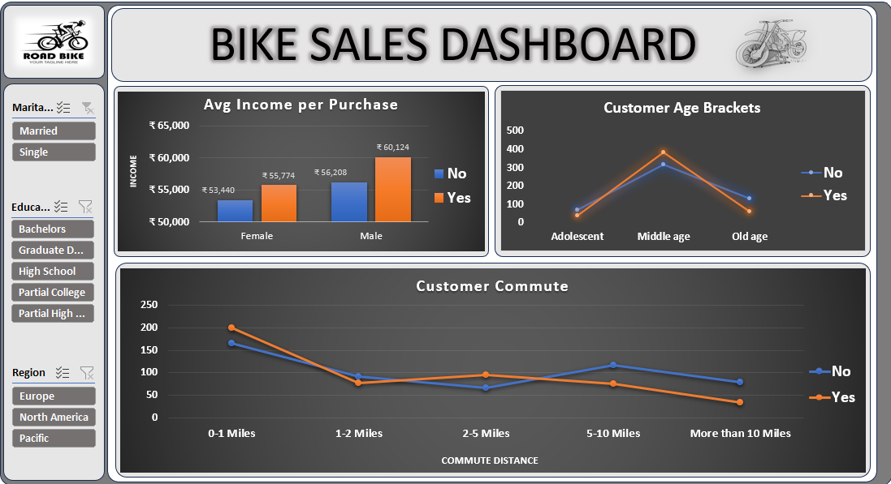
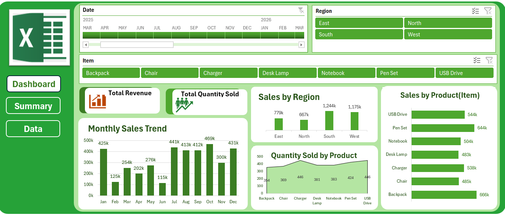
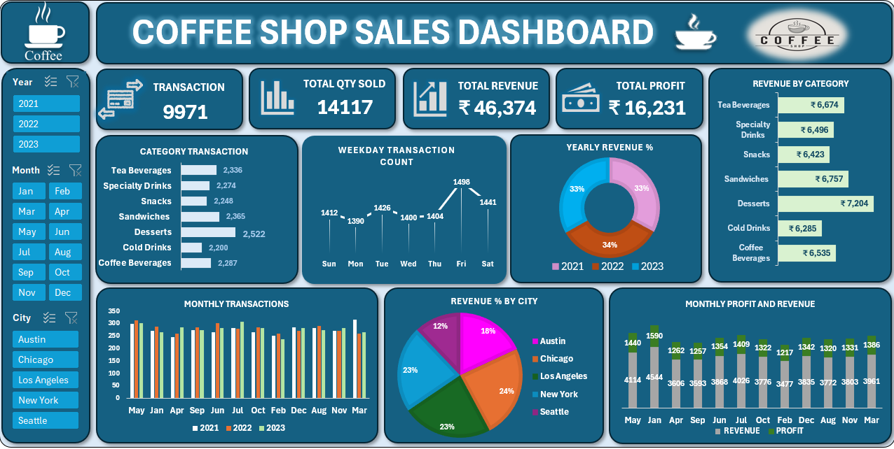

# 📊 Excel Dashboard Portfolio

## About

Welcome to my **Excel Dashboard Portfolio**!

This repository showcases three interactive Excel dashboard projects developed using Microsoft Excel. These projects demonstrate my ability to clean data, analyze datasets, create Pivot Tables, and build interactive dashboards that provide meaningful business insights.

---

## 🛠️ Tools & Skills Used

- Microsoft Excel
- Data Cleaning
- Data Analysis
- Pivot Tables
- Pivot Charts
- Slicers
- Timelines
- Conditional Formatting
- Excel Formulas
- Dashboard Design
- Data Visualization

---

# 📁 Project 1 – Bike Sales Dashboard

### Objective
Analyze customer demographics and purchasing behavior to understand the factors influencing bike purchases.

### Features
- Data Cleaning
- Pivot Tables
- Interactive Dashboard
- Slicers
- Charts and Visualizations

### Key Insights
- Bike purchases by gender
- Income comparison of buyers and non-buyers
- Customer age group analysis
- Commute distance analysis
- Regional sales insights

**File:** `Bike Sales Dashboard.xlsx`

---

# 📁 Project 2 – Sales Performance Dashboard

### Objective
Analyze sales data to monitor business performance and identify trends across customers, products, and regions.

### Features
- Data Cleaning
- Pivot Tables
- Pivot Charts
- Interactive Dashboard
- Slicers

### Key Insights
- Total sales performance
- Regional sales comparison
- Product-wise sales analysis
- Customer purchase trends
- Sales distribution

**File:** `Sales Performance Dashboard.xlsx`

---

# 📁 Project 3 – Coffee Shop Sales Dashboard

### Objective
Analyze coffee shop sales data to understand revenue, product performance, and overall business trends.

### Features
- Data Cleaning
- Pivot Tables
- Interactive Dashboard
- Charts
- Slicers

### Key Insights
- Total revenue
- Profit analysis
- Best-selling products
- Branch-wise performance
- Sales trends

**File:** `Coffee Shop Sales Dashboard.xlsx`

---

## 📂 Repository Structure

```text
Excel-Dashboard-Portfolio
│
├── Bike Sales Dashboard.xlsx
├── Sales Performance Dashboard.xlsx
├── Coffee Shop Sales Dashboard.xlsx
├── bike-sales-dashboard.png
├── sales-performance-dashboard.png
├── coffee-shop-sales-dashboard.png
└── README.md
```

---

## 📸 Dashboard Preview

### Bike Sales Dashboard



---

### Sales Performance Dashboard



---

### Coffee Shop Sales Dashboard



---

## 🎯 Skills Demonstrated

- Data Cleaning and Preparation
- Interactive Dashboard Development
- Business Data Analysis
- Data Visualization
- Pivot Table Reporting
- Business Insight Generation
- Excel Reporting

---

## 👩‍💻 About Me

I am an Electronics and Communication Engineering graduate with a strong interest in **Data Analytics**. I enjoy transforming raw data into meaningful insights using Excel and continuously improving my skills in SQL, Power BI, Python, and Data Visualization.

---

⭐ Thank you for visiting my portfolio!
